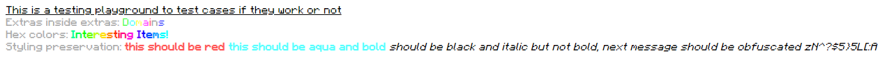

# <minecraft-text> Web Component
The goal of this project is to make Raw JSON Text Format (Java Edition) easily usable via a web component.

## Usage:
`<minecraft-text>Put Raw JSON Text Here</minecraft-text>`

## Example:
```html
<div>
        <minecraft-text>{"text":"This is a testing playground to test cases if they work or not","underlined":true}</minecraft-text>
    </div>
    <div>
        <minecraft-text>{"text":"Extras inside extras:","color":"gray"}</minecraft-text>
        <minecraft-text>{"italic":false,"color":"green","extra":[{"color":"aqua","extra":[{"color":"yellow","extra":[{"color":"light_purple","extra":[{"color":"red","extra":[{"color":"gray","extra":[{"color":"blue","text":"s"}],"text":"n"}],"text":"i"}],"text":"a"}],"text":"m"}],"text":"o"}],"text":"D"}</minecraft-text>
    </div>
    <div>
        <minecraft-text>{"text":"Hex colors:","color":"gray"}</minecraft-text>
        <minecraft-text>{"bold":true,"italic":false,"extra":[{"color":"#00FFA4","text":"I"},{"color":"#00FF4B","text":"n"},{"color":"#0EFF00","text":"t"},{"color":"#68FF00","text":"e"},{"color":"#C3FF00","text":"r"},{"color":"#FFE100","text":"e"},{"color":"#FF8700","text":"s"},{"color":"#FF2D00","text":"t"},{"color":"#FF002D","text":"i"},{"color":"#FF0086","text":"n"},{"color":"#FF00E0","text":"g"},{"color":"#C300FF","text":" "},{"color":"#6800FF","text":"I"},{"color":"#0F00FF","text":"t"},{"color":"#004BFF","text":"e"},{"color":"#00A5FF","text":"m"},{"color":"#00FFFF","text":"s"},{"text":"!"}],"text":""}</minecraft-text>
        
    </div>
    <div>
        <minecraft-text>{"text":"Styling preservation:","color":"gray"}</minecraft-text>
        <minecraft-text>[{"color":"red"},{"text":"this should be red ","bold":"true"},{"text":"this should be aqua and bold ","color":"aqua"},{"text":"should be black and italic but not bold, next message should be obfuscated ","color":"black","italic":true,"bold":false},{"text":"abcdabcdabcd","obfuscated":true}]</minecraft-text>
    </div>
```

